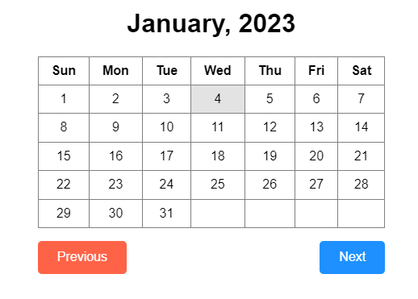
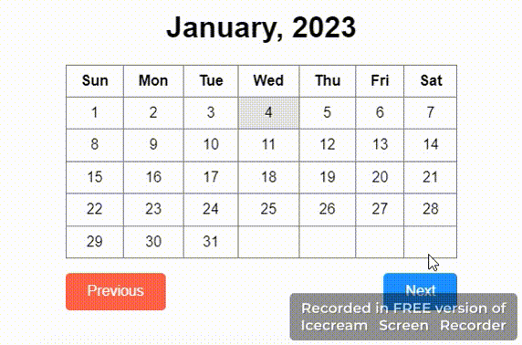

### Challenge 3: Calendar

**Playground:** [CodePen](https://codepen.io/rafiulislamrafi/pen/dyjpxEg)

Design a calendar application where you can view current month, days , previous and next month calendars

- Should display all data same as in a calendar.
- Should handle all edge cases (months which have 31 days and we need extra rows)
- A prev and next button to navigate between months and year
- A div displaying current date and month.

#### Instructions:

- No need to focus on responsiveness.
- No use of any library or framework.
- Code should be well structured with optimised solution.
- Code should easily accomodate new requirements and minimal changes.

### Demo

> Default state

> Demo

